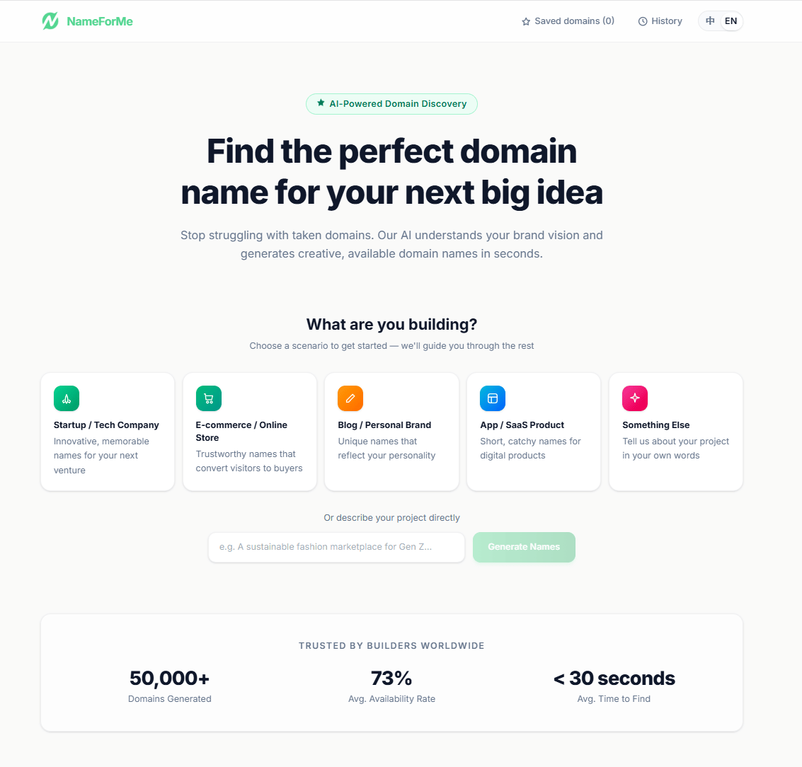
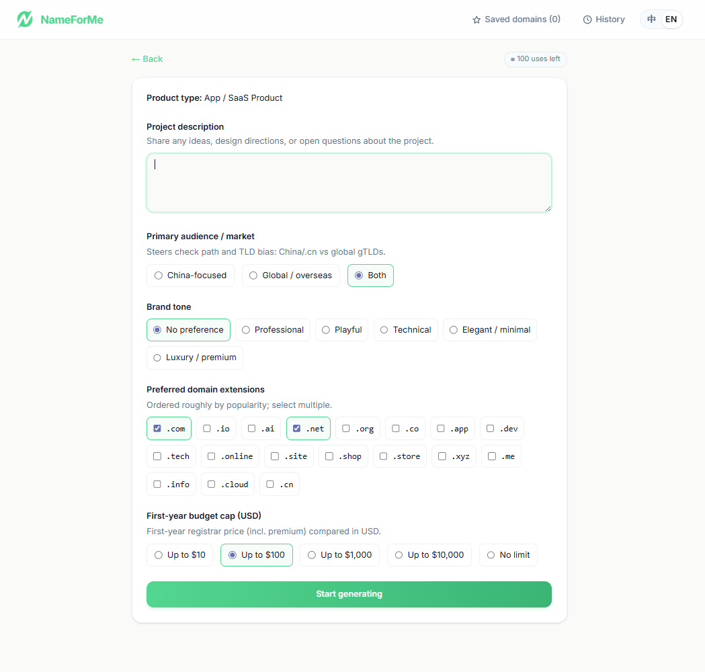
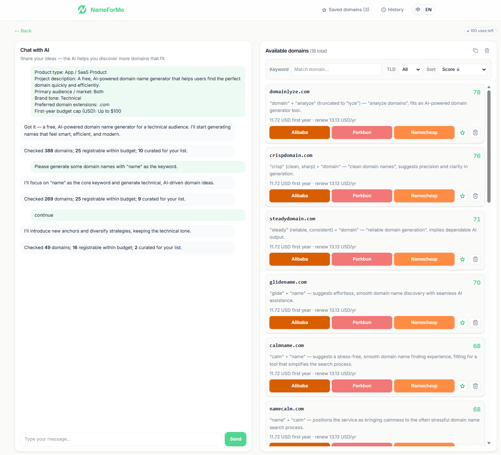

<p align="center">
  
</p>

<h1 align="center">NameForMe · 起好名</h1>

<p align="center"><b>理解品牌意图的 AI 双语域名发现工具，只给你真正可以注册的域名。</b></p>

<p align="center">
  <a href="https://nameforme.com">官网</a> ·
  <a href="https://github.com/jackieniu/NameForMe">GitHub</a> ·
  <a href="./README.md">English</a>
</p>

<p align="center">
  
  
  
  
  
</p>



---

## ✨ 为什么选 NameForMe

现有的 AI 域名生成器几乎都有同一个毛病：**看起来好听，一查全被注册了**。我们换了个做法。

- **所见即可注册** — 每一个展示给你的域名，都已通过阿里云 / Namecheap 实时可用性 API 预检。
- **对话式理解品牌** — 多轮追问业务、市场、调性、禁忌词，AI 据此动态选择命名策略，而不是简单关键词拼接。
- **中英双语原生** — 中文创业者找英文域名这件事，我们当一等公民来做。
- **一键跳转注册商** — 同一卡片并排阿里云万网 / Porkbun / Namecheap，带 Affiliate 参数。
- **开源 & 免费** — MIT License，可自部署；喜欢的话直接用官网托管版。

---

## 🖼️ 产品速览

**1. 从场景开始** — 无需起步门槛，选一个贴近你的场景即可进入。


**2. 理解你的品牌** — 一份轻量问卷收集目标市场、调性、偏好后缀和预算，AI 据此决策命名方向。



**3. 边对话、边生成、边检测** — 左侧是对话与进度提示，右侧是**实时可注册**的候选域名，带 AI 评分、命名理由、首年/续费价格，以及三家注册商的一键注册。



---

## 🧩 核心功能

|                       |                                                              |
| --------------------- | ------------------------------------------------------------ |
| 🤖 **AI 对话澄清**        | 多轮追问，也可随时「开始生成」跳过                           |
| 🎯 **多策略生成**          | 内置十余种命名策略：词组合、熔合造词、隐喻、前后缀品牌化、拼音音节、跨语言借词等 |
| ✅ **实时可用性**           | 阿里云 / Namecheap 实时 API，结果=可注册；`.ai` 等特殊 TLD 走 Porkbun 公共价目补全 |
| 🏅 **AI 评分与理由**       | 0–100 综合评分 + 一句话命名理由，方便快速挑选             |
| 💰 **价格透明**           | 首年价、续费价、溢价标注；按语言切换货币                   |
| 🔗 **Affiliate 跳转**   | 阿里云 / Porkbun / Namecheap 三选一，带推广参数           |
| ⭐ **收藏与历史**           | `localStorage` 本地存储，无需账号                            |
| 🌐 **中英双语**           | `zh/` 与 `en/` 独立路由，SEO 友好                             |
| 🛡️ **防刷与熔断**         | IP 限流 + 可选 Cloudflare Turnstile + KV/D1 持久化            |

---

## 🛠️ 技术栈

- **框架**：Next.js 15（App Router）· React 19 · TypeScript 5
- **样式**：Tailwind CSS v4 · 语义变量驱动的品牌色板（`#53d690`）
- **AI**：Vercel AI SDK 6 · OpenAI 兼容（DeepSeek / OpenAI / Azure / 本地 vLLM 任选）
- **国际化**：next-intl 4
- **数据校验**：Zod 4
- **测试**：Playwright
- **可选持久化**：Cloudflare KV + D1（限流与黑名单）

---

## 🚀 快速开始

```bash
git clone https://github.com/jackieniu/NameForMe.git
cd NameForMe
cp .env.example .env.local    # 填入 LLM 三项与域名检测凭证
npm install
npm run dev                   # http://localhost:3000
```

生产构建：

```bash
npm run build && npm run start
```

---

## 🔑 最小环境变量

完整清单见 [`.env.example`](./.env.example)。

```env
# 大模型（OpenAI 兼容，三项均必填）
LLM_API_KEY=sk-xxx
LLM_BASE_URL=https://api.deepseek.com/v1
LLM_MODEL=deepseek-chat

# 域名可用性检测（二选一）
ALIYUN_ACCESS_KEY_ID=
ALIYUN_ACCESS_KEY_SECRET=
# 或
NAMECHEAP_API_USER=
NAMECHEAP_API_KEY=
NAMECHEAP_CLIENT_IP=
```

> **提示**：LLM 三项与域名检测凭证任一缺失，相关接口会直接返回错误 — 我们**不使用模拟数据**。

切换大模型供应商只改环境变量，代码零改动：

```env
# OpenAI
LLM_API_KEY=sk-...
LLM_BASE_URL=https://api.openai.com/v1
LLM_MODEL=gpt-4o-mini

# 本地 vLLM / Ollama 等
LLM_BASE_URL=http://127.0.0.1:8000/v1
LLM_MODEL=qwen2.5-14b-instruct
```

---

## ☁️ 部署

### Vercel（一键部署）

[](https://vercel.com/new/clone?repository-url=https%3A%2F%2Fgithub.com%2Fjackieniu%2FNameForMe)

点击按钮后按向导连接 GitHub，即可在 Vercel 从本仓库创建项目并完成首次部署。**部署完成后**，在 Vercel → Project → **Settings → Environment Variables** 中按 [`.env.example`](./.env.example) 填写 `LLM_API_KEY`、`LLM_BASE_URL`、`LLM_MODEL` 及域名检测等变量，然后重新部署一次使配置生效。

### Cloudflare Pages

`npm run build` → 绑定 KV `BLOCKLIST` 与 D1 `DB`（见 `wrangler.toml`）。

### Node 自托管

`npm run build && npm run start -- --port 3000`

---

## 💬 意见与建议

NameForMe 仍在持续迭代，非常希望听到你的声音。无论是功能想法、使用体验，还是发现了 Bug，都欢迎反馈：

- **[提交 Issue](https://github.com/jackieniu/NameForMe/issues)**：描述复现步骤、期望行为或产品建议，便于跟踪与讨论。
- **邮箱**：[nameforme@thesuper.me](mailto:nameforme@thesuper.me) — 若不便在 Issue 中公开讨论，可直接发邮件。

每一条反馈都会被认真阅读，并直接影响后续版本的优先级与方向。感谢你帮助 NameForMe 变得更好。

---

## 🤝 参与贡献

欢迎 Issue / PR。提交前请：

1. `npm run build` 通过、无任何错误
2. 提交信息使用简短前缀（`feat:` / `fix:` / `refactor:` / `docs:` / `chore:`）
3. UI 改动附截图或录屏
4. 用户可见文案同步更新 `messages/zh.json` 与 `messages/en.json`

---

## 📄 License

[MIT](./LICENSE) © 2026 [jackieniu](https://github.com/jackieniu)

---

<p align="center"><sub>如果这个项目帮到你，顺手给仓库点个 ⭐ 就是最大的支持。</sub></p>
